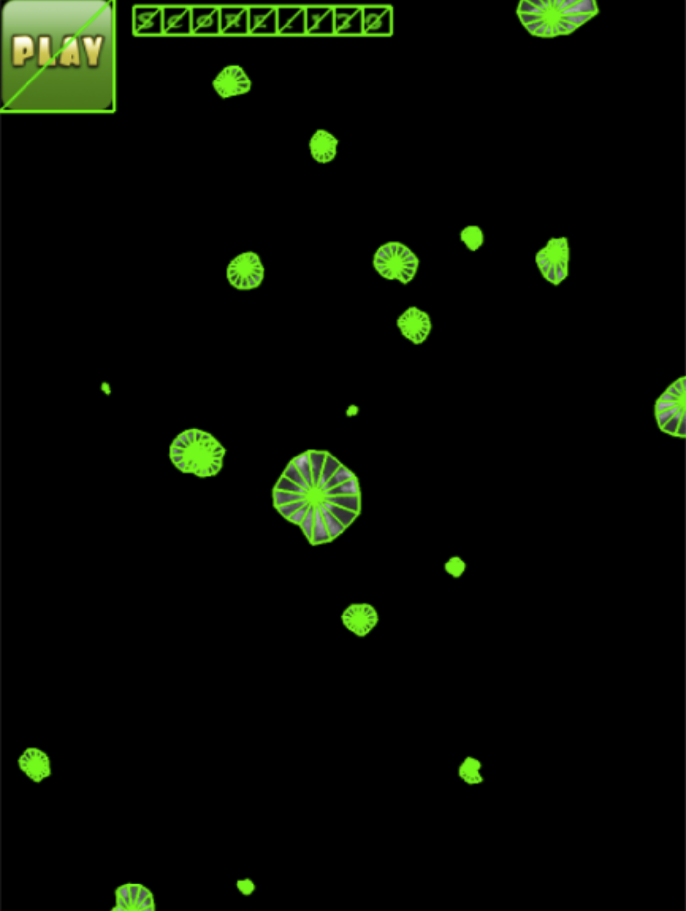
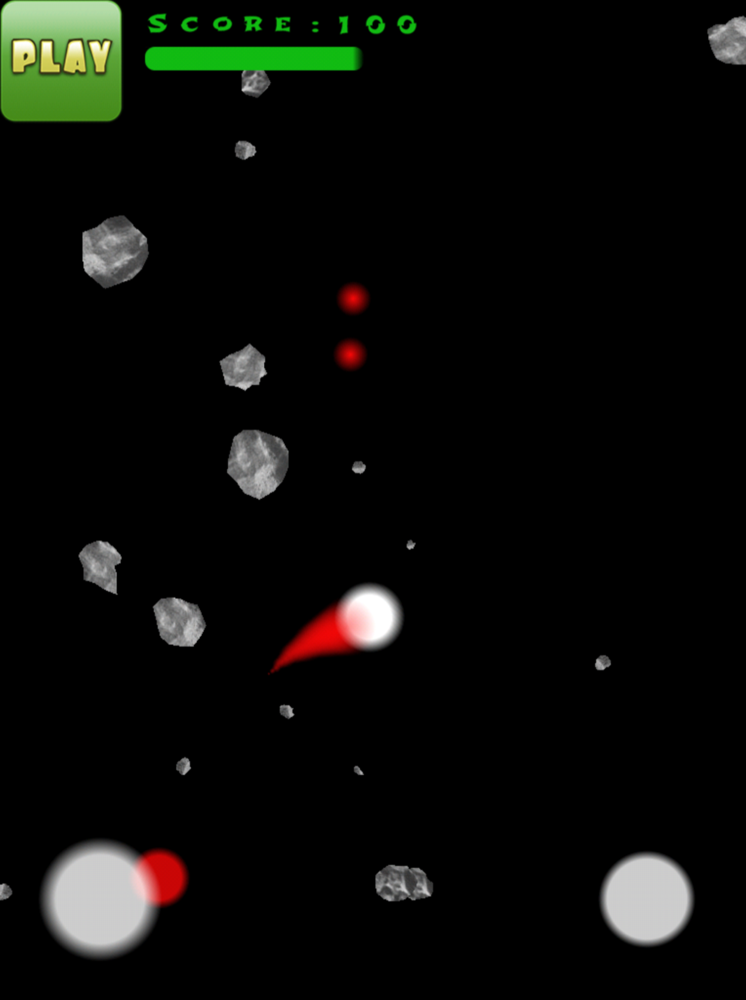
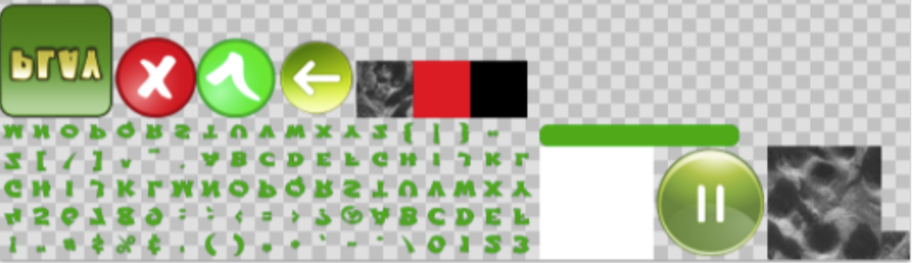

Asteroids
========

## Purpose
- Just for fun :)

## What is the point?
- learn basic of OpenGL ES 2.0
	- [Shaders](https://www.raywenderlich.com/70208/opengl-es-pixel-shaders-tutorial)
	- How properly use GPU memory
- learn basic of XCode tools and IOS developemnt:
	- [XCode OpenGL debug tools](https://developer.apple.com/library/ios/documentation/3DDrawing/Conceptual/OpenGLES_ProgrammingGuide/ToolsOverview/ToolsOverview.html)
	- [XCode time measure tools](https://developer.apple.com/library/ios/documentation/ToolsLanguages/Conceptual/Xcode_Overview/MeasuringPerformance.html)
	- [XCode memory leaks tools](https://developer.apple.com/library/mac/documentation/Performance/Conceptual/ManagingMemory/Articles/FindingLeaks.html)
- learn basic design patterns like:
	- [Composite pattern](https://en.wikipedia.org/wiki/Composite_pattern)
	- [State Machine pattern](https://en.wikipedia.org/wiki/State_pattern)
	- [Singleton pattern](https://en.wikipedia.org/wiki/Singleton_pattern)
	- [Factory method pattern](https://en.wikipedia.org/wiki/Factory_method_pattern)
	- and others...
- learn basics of alghoritms:
	- [Reduction of collision computations with applying hash functions](http://matthias-mueller-fischer.ch/publications/tetraederCollision.pdf)
	- [Binary packing alghoritms](http://codeincomplete.com/posts/2011/5/7/bin_packing/)
	- [Gilbert–Johnson–Keerthi distance](https://en.wikipedia.org/wiki/Gilbert%E2%80%93Johnson%E2%80%93Keerthi_distance_algorithm)
- create analogy of [Cocos2D](http://www.cocos2d-x.org/)
- create game from own primitievs

